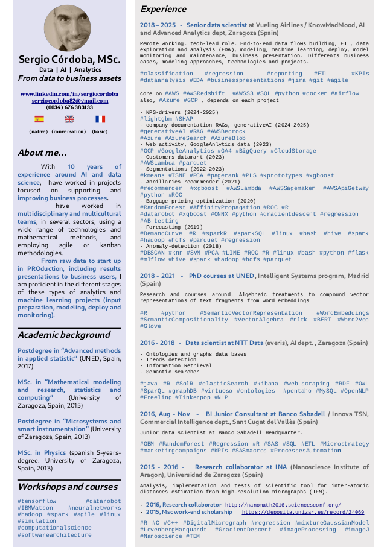

* content
{:toc}
Some EDA examples... 


...en pdf...

```
[Ver documento PDF](git-site-img/cv_sergiocordoba_page1.pdf)
```


...como imagen...

```markdown

```


....como html...

```
<div style="text-align: center;">
    
</div>
```